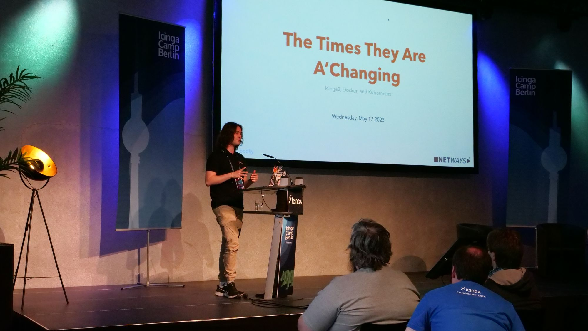

# About Me

I'm Daniel, a 25 years **Technology Evangelist** from Southern Germany. I work for [NETWAYS Web Services](https://nws.netways.de) in Nuremberg, where I'm advocating (not only!) for our cloudnative products and services.

My area of interest mainly revolves around **Kubernetes**, where I am striving to gain more hands-on experience each and every day after becoming **CKA-** and **CKAD-certified**, thanks to the **LiFT-2022 scholarship**.

I've got a strong interest in **automation**, especially **GitOps**, tools helping with **developer experience**, and **container technologies**. Sometimes I **write** about those topics or **give talks** at conferences.

You can find me on **GitHub**, **Twitter**, and **LinkedIn** if you want to contact me or got questions. Just follow the social links on the homepage - I'm always happy to get in touch with new folks.

When I'm not actively posting on here, it's probably because I'm creating content somewhere else - you can find a selection here.
