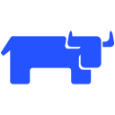

---
hide:
  - feedback
  - footer
  - navigation
  - toc
title: dbodky.me
description: My personal website focusing on cloud-native topics, discoveries, and my homelab.
---

  

    <!-- Grafana -->
    
    
    
    
    
    
    
    
    
    
    
  

  
  

    <h1>Hi, I'm Daniel</h1>
    
Developer Advocate & Cloud-Native Educator

    
I break things, fix them, and share the lessons along the way.

    

      <a href="blog/" class="hero-button primary-button">My Blog</a>
      <a href="#contact" class="hero-button secondary-button">Get In Touch</a>
    

  

  
  

    

    Scroll down to explore more content
  

  

    

    

    

    

  

  <section id="content-section" class="merged-section">
    

      <!-- About Me Section -->
      

        

          <h2>About Me</h2>
          

            
              <svg xmlns="http://www.w3.org/2000/svg" width="24" height="24" viewBox="0 0 24 24" fill="none" stroke="currentColor" stroke-width="2" stroke-linecap="round" stroke-linejoin="round" class="section-icon"><circle cx="12" cy="12" r="10"></circle><circle cx="12" cy="12" r="4"></circle></svg>
            
          

        
  
        

          

            

              
            

          

          

            
My passion lies in breaking down complex technological concepts to help practictioners adopt modern cloud practices.

            

              Kubernetes
              Cloud-Native
              DevOps
              GitOps
              Technical Writing
              Public Speaking
              Trainings
            

            

              <a href="blog/" style="font-size: 0.7rem;" class="hero-button primary-button">Read More on My Blog</a>
            

          

        

      

      <!-- Section Separator -->
      

        

        

          <svg xmlns="http://www.w3.org/2000/svg" width="24" height="24" viewBox="0 0 24 24" fill="none" stroke="currentColor" stroke-width="2" stroke-linecap="round" stroke-linejoin="round"><path d="M12 5v14"></path><path d="M18 13l-6 6"></path><path d="M6 13l6 6"></path></svg>
        

      

      <!-- Contact Section -->
      

        

          <h2>Get in Touch</h2>
          

            
            <svg xmlns="http://www.w3.org/2000/svg" width="24" height="24" viewBox="0 0 24 24" fill="none" stroke="currentColor" stroke-width="2" stroke-linecap="round" stroke-linejoin="round" class="section-icon"><path d="M14 9a2 2 0 0 1-2 2H6l-4 4V4a2 2 0 0 1 2-2h8a2 2 0 0 1 2 2z"/><path d="M18 9h2a2 2 0 0 1 2 2v11l-4-4h-6a2 2 0 0 1-2-2v-1"/></svg>
            
          

          
Have questions or want to collaborate? I'm always open to discussing cloud-native technologies and collaboration.

        

        

          

            

              <svg xmlns="http://www.w3.org/2000/svg" width="24" height="24" viewBox="0 0 24 24" fill="none" stroke="currentColor" stroke-width="2" stroke-linecap="round" stroke-linejoin="round"><rect x="3" y="4" width="18" height="18" rx="2" ry="2"></rect><line x1="16" y1="2" x2="16" y2="6"></line><line x1="8" y1="2" x2="8" y2="6"></line><line x1="3" y1="10" x2="21" y2="10"></line></svg>
            

            <h3>Schedule a Call</h3>
            
Book a time slot that works for you to discuss your project or ideas.

            <a href="https://cal.com/dbodky/30min" target="_blank" class="contact-button">Schedule a Call</a>
          

          

            

              <svg xmlns="http://www.w3.org/2000/svg" width="24" height="24" viewBox="0 0 24 24" fill="none" stroke="currentColor" stroke-width="2" stroke-linecap="round" stroke-linejoin="round"><path d="M4 4h16c1.1 0 2 .9 2 2v12c0 1.1-.9 2-2 2H4c-1.1 0-2-.9-2-2V6c0-1.1.9-2 2-2z"></path><polyline points="22,6 12,13 2,6"></polyline></svg>
            

            <h3>Email Me</h3>
            
Reach out directly with your questions or collaboration ideas.

            <a href="mailto:blog@dbodky.me" class="contact-button">Email Me</a>
          

          

            

              <svg xmlns="http://www.w3.org/2000/svg" width="24" height="24" viewBox="0 0 24 24" fill="none" stroke="currentColor" stroke-width="2" stroke-linecap="round" stroke-linejoin="round"><path d="M21 15a2 2 0 0 1-2 2H7l-4 4V5a2 2 0 0 1 2-2h14a2 2 0 0 1 2 2z"></path></svg>
            

            <h3>Connect With Me</h3>
            
You can find me on many social platforms - links are in the footer.

          

        

      

    </section>

