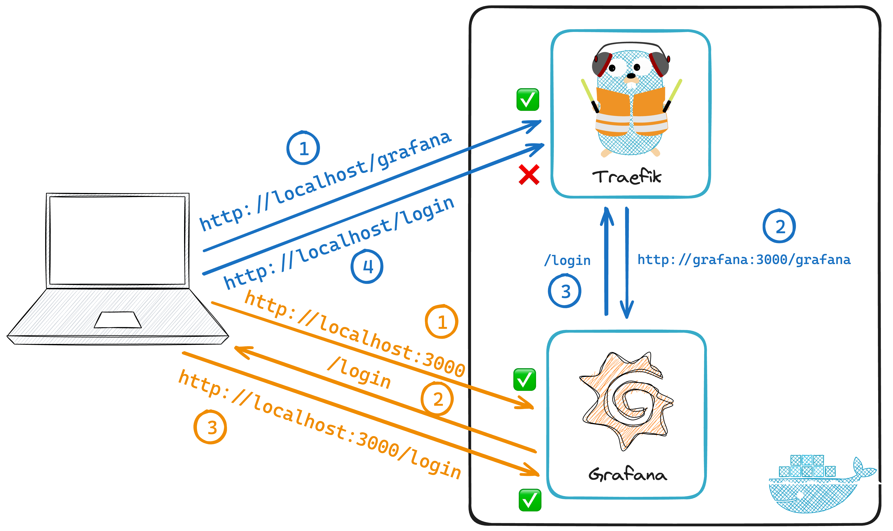
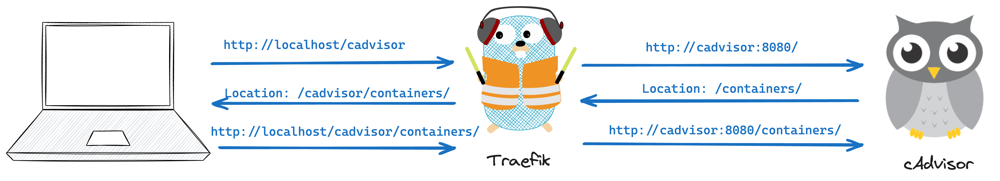

One of my goals for 2024 is to get my homelab back up and running. Since I want to be able to access my applications on easy-to-remember domains, I use [Traefik](https://traefik.io) as a reverse-proxy. This allows me to access my applications on **subdomains** or **paths**, like this:

- `https://prometheus.dbodky.me`
- `https://dbodky.me/grafana`

While the former is easy to set up, the latter can be a bit tricky sometimes. In this post, I'll explain why and show you how to set up Traefik to reverse-proxy applications on subpaths.

## The Problem

To understand why it can be problematic to reverse-proxy applications on a subpath sometimes, let's walk through the scenario together, with the example above:

`https://dbodky.me/grafana`

The following compose file can be spun up using `docker compose up -d` and will create two containers, one for Traefik and one for Grafana:

```yaml
services:
  traefik:
    image: traefik:latest
    container_name: traefik
    command:
      - --api.insecure=true
      - --api.dashboard=true
      - --providers.docker=true
      - --entrypoints.web.address=:80
    ports:
      - 80:80
      - 8080:8080
    volumes:
      - /var/run/docker.sock:/var/run/docker.sock:ro

  grafana:
    labels:
      - traefik.http.routers.grafana.rule=PathPrefix(`/grafana`)
      - traefik.http.routers.grafana.entrypoints=web
      - traefik.enable=true
    image: grafana/grafana:latest
    ports:
      - 3000:3000
    container_name: grafana
```

If you navigate to [http://localhost:8080/dashboard/#/http/routers/grafana@docker](http://localhost:8080/dashboard/#/http/routers/grafana@docker), you'll see that Traefik has created a router for Grafana, according to the labels we've set in the compose file:

<figure markdown="span">

  
  <figcaption>Traefik created a router for Grafana at `/grafana`</figcaption>

</figure>

Let's try connecting to Grafana by navigating to [http://localhost/grafana](http://localhost/grafana). Unfortunately, this doesn't work. Instead, we get **redirected** to `http://localhost/login` and a **404 page**.

Just to make sure, let's try connecting to Grafana **directly** at [http://localhost:3000](http://localhost:3000). This works, Grafana is running and accessible. **So what's the problem?**

### Running Applications on Configurable Subpaths

Grafana is not aware of the fact that it's being reverse-proxied. When we navigate to `http://localhost/grafana`, Grafana thinks that it's being accessed at the **root path** (`/`), and redirects us to its login page at `/login`.

This redirect gets reverse-proxied by Traefik again, but there's no rule for `/login` - we get served a `404` error.

<figure markdown="span">

  
  <figcaption>Request flows in our compose stack</figcaption>

</figure>

Luckily, many applications allow us to configure the **root path** they're being accessed at. In Grafana's case, we can add the following block to its `service` definition in our compose file:

```yaml
environment:
  - GF_SERVER_ROOT_URL=%(protocol)s://%(domain)s:%(http_port)s/grafana
  - GF_SERVER_SERVE_FROM_SUB_PATH=true
```

After restarting the stack by issuing `docker compose up -d` again, we can now access Grafana at [http://localhost/grafana](http://localhost/grafana) and it works as expected.

**But how do we deal with applications that don't allow us to configure the root path?**

### Running Arbitrary Applications on Subpaths

**The reason I am writing this post** is because I was trying to set up [cAdvisor](https://github.com/google/cadvisor), a tool for monitoring Docker containers, on a subpath. Unfortunately, cAdvisor doesn't allow us to configure the root path, so I ran into the same problem as above.

Let's add cAdvisor to our compose file and see what happens when we try to access it at [http://localhost/cadvisor](http://localhost/cadvisor):

```yaml
services:
  [...]
  cadvisor:
    labels:
      - "traefik.enable=true"
      - "traefik.http.routers.cadvisor.rule=PathPrefix(`/cadvisor`)"
      - "traefik.http.routers.cadvisor.entrypoints=web"
    image: gcr.io/cadvisor/cadvisor:v0.47.2
    container_name: cadvisor
    volumes:
      - /:/rootfs:ro
      - /var/run:/var/run:ro
      - /sys:/sys:ro
      - /var/lib/docker/:/var/lib/docker:ro
      - /dev/disk/:/dev/disk:ro
    devices:
      - /dev/kmsg
    privileged: true
```

As expected, we get served a `404` error, because cAdvisor tries to redirect us to `/containers/`, apparently. **So how do we fix this?**

## The Solution(s)

As cAdvisor doesn't allow us to configure the root path, we have to find a different solution to our problem. The obvious one relies on Traefik's `StripPrefix` middleware. It works like this:

1. We hit Traefik with a request to `/cadvisor`
2. Traefik determines that the request should be routed to cAdvisor
3. Traefik strips the prefix `/cadvisor` from the request before forwarding it to cAdvisor

We can add the following label to cAdvisor's service definition to enable the `StripPrefix` middleware and check the result in Traefik at [http://localhost:8080/dashboard/#/http/routers/cadvisor@docker](http://localhost:8080/dashboard/#/http/routers/cadvisor@docker):

```yaml
- "traefik.http.middlewares.prefixstripper.stripprefix.prefixes=/cadvisor"
- "traefik.http.routers.cadvisor.middlewares=prefixstripper"
```

<figure markdown="span">
  
  
  <figcaption>Traefik added the `StripPrefix` middleware to our cAdvisor router</figcaption>

</figure>

Let's try connecting to [http://localhost/cadvisor](http://localhost/cadvisor) again - **the** `404` **persists**. 😱 cAdvisor's behaviour didn't change - it still redirects to `/containers/` upon requests, thus messing up our routing instructions.

What _does_ work is connecting to [http://localhost/cadvisor/containers/](http://localhost/cadvisor/containers/) directly. Traefik first matches the request to the `cadvisor` router, strips the prefix `/cadvisor` and forwards the `/containers/` request to cAdvisor. _This one_ cAdvisor knows how to handle! **So what are we missing?**

We already established that the problem arises upon **redirects**. Thus, we have two options:

1. Always entering the **full address** to the site we want to access, e.g. [http://localhost/cadvisor/containers/](http://localhost/cadvisor/containers/) (**impractical**) 👎
2. **Rewriting** redirects to the **full path** before they get sent to the client (**better**) 👍

Unfortunately, there exists no builtin middleware for rewriting redirects in Traefik, despite [years-old requests to implement this feature](https://github.com/traefik/traefik/issues/5809). However, with the introduction of **plugins** for Traefik, the community took matters into their own hands and created several plugins for rewriting (Redirect) headers.

In my case, the [rewrite-headers plugin on GitHub](https://github.com/XciD/traefik-plugin-rewrite-headers) did the trick. First, we have to install the plugin by adding the following lines to Traefik's `command` in our compose file:

```yaml
- --experimental.plugins.rewriteHeaders.moduleName=github.com/XciD/traefik-plugin-rewrite-headers
- --experimental.plugins.rewriteHeaders.version=v0.0.4
```

Then, we can add the following labels to cAdvisor's `labels` to use the freshly installed plugin as middleware:

```yaml
- "traefik.http.middlewares.cadvisor-redirect.plugin.rewriteHeaders.rewrites[0].header=Location"
- "traefik.http.middlewares.cadvisor-redirect.plugin.rewriteHeaders.rewrites[0].regex=^(.+)$$"
- "traefik.http.middlewares.cadvisor-redirect.plugin.rewriteHeaders.rewrites[0].replacement=/cadvisor$$1"
- "traefik.http.routers.cadvisor.middlewares=auth,cadvisor-prefixstripper,cadvisor-redirect"
```

With this configuration, every redirect header containing the `Location` field will have its contents modified, from .e.g `/containers/` to `/cadvisor/containers/`. Below is a schematic of the request flow:

<figure markdown="span">

  
  <figcaption>Request flow with the rewrite-headers plugin</figcaption>

</figure>

With this new middleware in place, we can finally access cAdvisor at [http://localhost/cadvisor](http://localhost/cadvisor) and it works as expected. Feel free to click around the web UI and see how the redirects get rewritten, always getting you to your desired destination.

For completeness' sake, here's the full compose file with all the changes we made:

```yaml
services:
  traefik:
    image: traefik:latest
    container_name: traefik
    command:
      - --api.insecure=true
      - --api.dashboard=true
      - --providers.docker=true
      - --entrypoints.web.address=:80
      - --experimental.plugins.rewriteHeaders.moduleName=github.com/XciD/traefik-plugin-rewrite-headers
      - --experimental.plugins.rewriteHeaders.version=v0.0.4
    ports:
      - 80:80
      - 8080:8080
    volumes:
      - /var/run/docker.sock:/var/run/docker.sock:ro

  grafana:
    labels:
      - traefik.http.routers.grafana.rule=PathPrefix(`/grafana`)
      - traefik.http.routers.grafana.entrypoints=web
      - traefik.enable=true
    image: grafana/grafana:latest
    environment:
      - GF_SERVER_ROOT_URL=%(protocol)s://%(domain)s:%(http_port)s/grafana
      - GF_SERVER_SERVE_FROM_SUB_PATH=true

    ports:
      - 3000:3000
    container_name: grafana

  cadvisor:
    labels:
      - "traefik.enable=true"
      - "traefik.http.routers.cadvisor.rule=PathPrefix(`/cadvisor`)"
      - "traefik.http.routers.cadvisor.entrypoints=web"
      - "traefik.http.middlewares.prefixstripper.stripprefix.prefixes=/cadvisor"
      - "traefik.http.middlewares.cadvisor-redirect.plugin.rewriteHeaders.rewrites[0].header=Location"
      - "traefik.http.middlewares.cadvisor-redirect.plugin.rewriteHeaders.rewrites[0].regex=^(.+)$$"
      - "traefik.http.middlewares.cadvisor-redirect.plugin.rewriteHeaders.rewrites[0].replacement=/cadvisor$$1"
      - "traefik.http.routers.cadvisor.middlewares=prefixstripper,cadvisor-redirect"
    image: gcr.io/cadvisor/cadvisor:v0.47.2
    container_name: cadvisor
    volumes:
      - /:/rootfs:ro
      - /var/run:/var/run:ro
      - /sys:/sys:ro
      - /var/lib/docker/:/var/lib/docker:ro
      - /dev/disk/:/dev/disk:ro
    devices:
      - /dev/kmsg
    privileged: true
```

## TL;DR

I learned quite a lot about Traefik and its available middlewares while trying to wrap my head around this problem. I hope this post helps you to understand how Traefik works and how to set it up to reverse-proxy applications on subpaths. There's basically two scenarios:

- You merely need to **strip the prefix** from the request before forwarding it to the application, either because your application can be **configured** to run on a subpath (_e.g Grafana_) or because it **doesn't redirect/link anywhere else** (_e.g. some SPAs_) . In this case, you can use the `StripPrefix` middleware.
- You need to **rewrite redirects** to the full path before sending them to the client, because your application **redirects or links** to other relative paths (_e.g. cAdvisor_). In this case, you can use the `rewrite-headers` plugin as shown above.